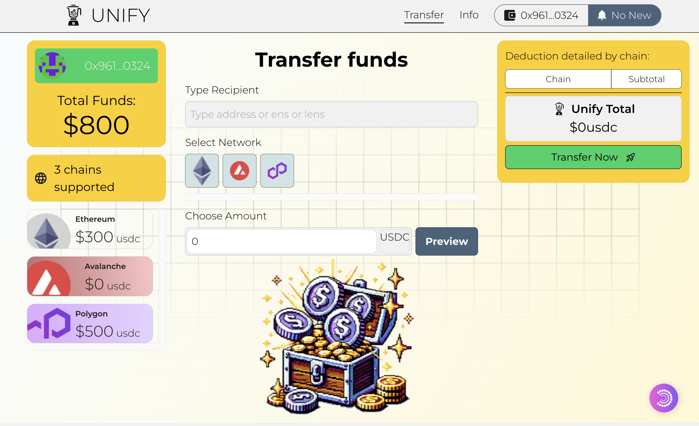

# Current Scenario
In the current web3 phase, we are used to having complex UX for sending funds to anyone.
This works for those who have been in the space for a long time (crypto-native) but for those who are not into the space and have no knowledge of tech, missing out on the power they can have using blockchain technology. 

We brought you **Grandma's Phone** to solve this significant mass adoption issue, starting with a minimal but most crucial function: _SENDING FUNDS_*.

# Overview

Grandma's Phone is a completely decentralized application where any user can send tokens (for now, USDC Only) to anyone without worrying about the different chains where they have funds.

## User Flow 
To send tokens to any address on any chain from any chain.\

The flow:
1. The user enters the recipient's address and the token amount.
2. The user signs the transaction.
3. The recipient receives the funds on the destination chain.

## Backend Flow 
We achieved this great UX using the following: 
- Particle Network
  - Connect Kit
    - https://github.com/0xLPircy/unifi-feb/blob/master/client/app/_components/AccountInfo.tsx
    - https://github.com/0xLPircy/unifi-feb/blob/master/client/app/_components/ConnectWallet.tsx
    - https://github.com/0xLPircy/unifi-feb/blob/master/client/app/_components/Providers/ParticleAuthProvider.tsx
  - [Auth Core Modal](https://github.com/0xLPircy/unifi-feb/blob/master/client/app/_container/dashboard/DeductionSection.tsx#L19C4-L37C37)
- [Chainlink CCIP](https://github.com/0xLPircy/unifi-feb/blob/master/contracts/src/TreasuryCrossChain.sol#L105)
- Covalent 
  - [Unified API](https://github.com/0xLPircy/unifi-feb/blob/master/client/app/api/index.ts)
  - GoldRush Kit
    - https://github.com/0xLPircy/unifi-feb/blob/master/client/app/_components/Providers/GoldKitProvider.tsx
    - https://github.com/0xLPircy/unifi-feb/blob/master/client/app/mynfts/page.tsx
    - https://github.com/0xLPircy/unifi-feb/blob/master/client/app/walletInfo/page.tsx

The flow:
1. The user enters the recipient's address and the token amount.
2. The backend searches the user's address across all the supported chains and sorts them into an array concerning minimum gas fees and the number of tokens to be sent from each chain.
3. The transaction data is created, and the user signs the transaction.
   - The array then passes to the `MainContract` contract's [`sendAsset`](https://github.com/0xLPircy/unifi-feb/blob/019403ac468a00573226fc862fc72e83c2ced137/contracts/src/MainContract.sol#L31) function.
4. Then, the `TreasuryCrossChain` contract's [`sendAssetsToTreasury`](https://github.com/0xLPircy/unifi-feb/blob/019403ac468a00573226fc862fc72e83c2ced137/contracts/src/TreasuryCrossChain.sol#L48) is called.
   - First, the transaction on the base chain (Avalanche Fuji) is executed, and the funds are transferred to the user's wallet to the Treasury Address on Avalanche.
   - Then, a loop is executed where the funds are transferred from the user's wallet to the treasury on each chain present in the initial array.
   - At last, the initial amount is sent from the treasury to the recipient's wallet on the destination chain.

# Transaction Links
Scenario: 
The user wants to send 600 $USDC to a receiver on Sepolia.
User wallet scenario:
- 300 $USDC on Avalanche Fuji
- 150 $USDC on Polygon Mumbai 
- 150 $USDC on Ethereum Sepolia

The user inputs the values, the backend creates the transaction data, and the user signs it on the base chain (Avalanche Fuji). 

1. Transaction initiation and funds transferred to the treasury on the base chain. [TxLink](https://testnet.snowtrace.io/tx/0xb5ca4ded130bcf39a65d55efb40c41f0165e233659925e28b94d9d7ebd8e69e4?chainId=43113)
2. The Transaction to send funds from User's Wallet to treasury on Mumbai is initiated by CCIP. [TxLink](https://ccip.chain.link/msg/0x09315f31042e262f42335a3c0ff38f87f0d41f258027d40013cce27a0bfdfc3a) 
3. Funds are sent from User's Wallet to the Treasury on Mumbai. [TxLink](https://mumbai.polygonscan.com/tx/0x8931c97e85f74a7fa676c3016474f9e0387cd131c2e786ae215d214a25c2cb5f) 
4. The Transaction to send funds from the User's Wallet to the treasury on Sepolia is initiated by CCIP. [TxLink](https://ccip.chain.link/msg/0x4f0613d99364ea2746d53e32accb57b2ff81fda95727ff6d952c4edbbcccb223) 
5. The transaction to send the funds from the Treasury to the receiver on Sepolia is initiated by CCIP. [TxLink](https://ccip.chain.link/msg/0xe5bdd7903457159216be7711b2efbd703ee6f0f33ef4c831aebecc3be2ee483e) 
6. Funds are dispatched from the User's Wallet to the Treasury and from the Treasury to the Receiver's Wallet on Sepolia. [TxLink](https://sepolia.etherscan.io/tx/0xfb7149dd064c676dfdf45a61313810a40493fc40eeeff0a8d03e228b7768bc44)